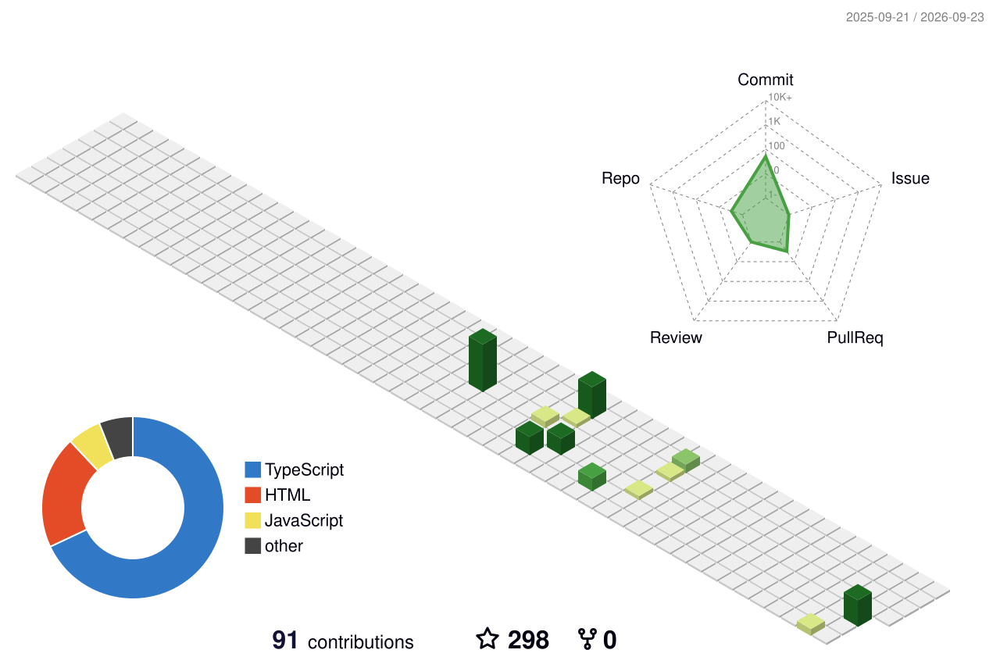

### Hi, I'm A. S. M. Radwan 👋

💼 Software Engineer at **総合システムリサーチ (Sogo System Research)**, Japan — previously at **Motivationworks株式会社** 
🎓 B.Sc. in Computer Science & Engineering, American International University-Bangladesh (AIUB) 
🌏 Based in Japan 
🔭 Full-stack development — web apps, Android, and Web3 experiments 
📫 radwanromy@gmail.com

    

### 🛠️ Tech Stack

### 📊 GitHub Stats

### 🚀 Featured Projects

**[Three.js WebGL 3D Portfolio](https://github.com/radwanromy/Three.js-WebGL-3D-website-project-By-A_S_M_Radwan)** — a 3D personal portfolio site built with Three.js

**[Blockchain Application, Web3 React Solidity](https://github.com/radwanromy/Blockchain-Application-Web-3.0-React-Solidity)** — a Web3 dApp built with React and Solidity

**[Android Location Proximity Alert](https://github.com/radwanromy/Android-Location-Proximity-Alert-Using-Google-Maps-Geofencing)** — geofencing reminders using the Google Maps API

**[Daily LeetCode Problem Solving](https://github.com/radwanromy/Daily-Leet-Code-Problem-Solving-Challenge)** — ongoing algorithm practice in C++

### 📈 More

