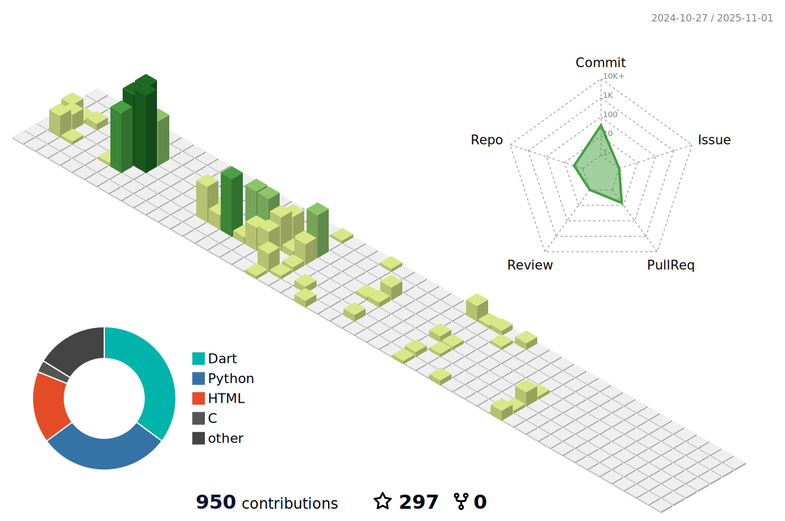

:mailbox: Reach me out! 

      
 
 

#### Profile Visits 

  Expend this to know some more about me

 

#### 
<!-- - :paperclip: [My Resume/CV](https://radwanromy.github.io/Japanese-Portfolio/assets/pdf/A.%20S.%20M.%20Radwan.pdf) -->
- :email: radwanromy@gmail.com   
 

<!-- 
#### Github Stats

 

<h3>📜 CARRER & APPLICATION INFORMATION</h3>
      
✴️ Looking For : Entry Level Job & Internship
✴️ Preferred Job Category : Software Engineer /Android Developer /Website Developer /Front–End Developer
✴️ Available For : Part Time / Full Time
✴️ Preferred District: Dhaka

      

<h3>📜 EDUCATION</h3>
        

         
🎓AMERICAN INTERNATIONAL UNIVERSITY BANGLADESH (AIUB), DHAKA

✴️PROGRAM : BACHELOR OF SCIENCE IN COMPUTER SCIENCE & ENGINEERING 

 ✴️STUDENT ID:18-36384-1 COMPLETED: 148

         
🎓GOVT. A. H. COLLEGE, BOGURA (GOVT. AHC, BOGURA) (2015-2017)

✴️EXAM PASSED: HSC (HIGHER SECONDARY SCHOOL CERTIFICATE) 

 ✴️FROM SCIENCE GROUP WITH GPA 4.75

         
🎓GOVT. GOBINDAGANJ BAHUMUKHI HIGH SCHOOL (2011-20 14)

✴️EXAM PASSED: SSC (SECONDARY SCHOOL CERTIFICATE) 

 ✴️FROM SCIENCE GROUP WITH GPA 5.00 (GOLDEN)

 <h3>👩🏽‍🚀 SPECIALIZATION & PROJECTS</h3>
1. Library Management Software (JAVA & SQL)
Banknotes Authentication Classification (Python & Jupiter :: Anaconda)

 
2. Sheba Publications (Database Project, Oracle ,MySQL)

 
3. University Online Course Registration System (Software 
Quality Assurance and Testing )

 
4. Educational Portal Modification (EPM) (software 
Engineering project)

 
5. Poultry And Frozen Food Company Management 
Software

 
6. Ultimate Travel Package (Object Oriented Analysis & 
Design)

 
7. ERP based :A poultry and frozen food company software
(Software Engineering)

 
8. Vacuum Cleaner Agent (Artificial-Intelligence)

 
9. Ultimate Travel Management System (OOP2 C#)

 
10. Basic Virtual Assistant (Python)

 
11. Scientific and Basic Both Calculator (C#)

 
12. Village View (Computer Graphics)

 
13. Hotel Management System (C-Sharp)

 
14. Game Streaming Website (Full Stack)

 
15. Django Web Frame Work (Python)
     

 <h3>📚 EXTRA EDUCATIONAL QUALIFICATIONS</h3>

        <h4>CISCO NETWORKING ACADEMY</h4>
 
🔖IT ESSENTIAL [CERTIFIED] 

 
🔖CYBER SECUIRTY [CERTIFIED] 

 
🔖INTERNET OF THINGS [CERTIFIED]

 
🔖INTRODUCTION TO PACKET TRACER [CERTIFIED]

OPERATING SYSTEM [CERTIFIED]

 
 

        <h4>LINKEDIN PREMIUM</h4>
 
🔖BECOME A FULL-STACK WEB DEVELOPER

 
🔖PHP ESSENTIAL TRAINING  

 
🔖REACT.JS ESSENTIAL TRAINING

 
🔖RUBY ON RAILS 5 ESSENTIAL TRAINING

 

        <h4>COURSERA.ORG</h4>
 
🔖UNIVERSITY OF MICHIGAN COLLEGE OF LITERATURE, 
SCIENCE, AND THE ARTS -
PYTHON 3 (PYTHON FOR EVERYBODY)[CERTIFIED]

🔖UNIVERSITY OF CALIFORNIA SAN DIEGO & NATIONAL 
RESEARCH UNIVERSITY HIG HER SCHOOL OF ECONOMICS - ALGORITHMIC TOOLBOX [CERTIFIED]

🔖GOOGLE AR & VR - INTRODUCTION TO AUGMENTED REALITY AND ARCORE [CERTIFIED]

   
 <h3>📜 WORK EXPERIENCE</h3>
        

         
 DECEMBER 2020–JANUARY 2020 

WEBSITE DEVELOPMENT • DEVELOPER • UP-WORK 

✴️WORK TYPE: GAME STREAMING 

 ✴️WEBSITE LINK : https://www.sizzle.gg/

         
 AUGUST 2020–OCTOBER 2020
 

WEBSITE DEVELOPMENT • DEVELOPER • ACC & AIUB AUTHORIT 

✴️EVENT NAME : JARVIS 2.0 INTRA ACC CARNIVAL 

 ✴️WEBSITE LINK : http://jarvis.aiubcc.org/

         
 JUNE 2019–DECEMBER 2019
 

WEBSITE DEVELOPMENT • DEVELOPER • ACC & AIUB AUTHORITY

✴️EVENT NAME : AIUB CYBER GAMIN FEST 2019
 

 ✴️WEBSITE LINK : http://cgf.aiubcc.org/

<h4>📍 CAMPUS AMBASSADOR</h4>

🏴Exploit 2019 [ACTIVE] 

🏴MindSparks-20 2020 [ACTIVE] 

🏴Bangladesh Innovation Forum [ACTIVE] 

🏴National Engineering Contest 2019 [FORMER] 

🏴MIST Robotics Club - Robolution-2019 [FORMER] 

🏴BUP Robotics Club and BUP InfoTech Club [FORMER]
 

 
 <h4>👨‍💻 VOLUNTARY EXPERIENCE</h4>

🏴International Conference On Robotics And Signal Processing Techniques 2019 (ICREST 
2019) 

🏴1st National Conference On Brian Engineering 

🏴AIUB Cyber Gaming Fest 2019
 

🏴AIUB CS FEST 2018 

🏴Samsung eSports championship 2019

🏴Youth Festival 2018 by Bangladesh ICT Division (Representative) 
 

 
🏴Cyber Security Challenge by Basis at AIUB
 

 
🏴Cyber Gaming Fest 2019 by ACC at AIUB
   <h2>✍️ SIGNATURE</h2> 

 -->

